# 📊 MVC DETS: Daily Expense Tracking System

[](https://www.oracle.com/java/technologies/javase/jdk17-archive-downloads.html)
[](https://jakarta.ee/specifications/servlet/)
[](https://jakarta.ee/specifications/pages/)
[](https://www.postgresql.org/)
[](https://tomcat.apache.org/)
[](https://getbootstrap.com/)
[](LICENSE)

A robust, enterprise-standard **Daily Expense Tracking System** built using the **Java MVC architecture**.  
This application enables users to manage personal finances efficiently with secure authentication, detailed expense analytics, and a responsive dashboard.

[**Explore the Docs »**](#-architecture-overview) | [**Report Bug »**](https://github.com/kunal-agr/mvcdets/issues) | [**Request Feature »**](https://github.com/kunal-agr/mvcdets/issues)

---

## ✨ Features

### Core CRUD Operations
- Add Expense
- View Expense List
- Edit Expense
- Delete Expense

### Expense Reports & Analytics
- Dashboard summary (Today, Yesterday, Last 7 Days)
- Date-wise expense reports
- Month-wise expense reports
- Year-wise expense reports
- Monthly and yearly expense analytics

### Authentication & User Management
- User registration
- Secure login & logout
- Session-based authentication
- Change password
- Forgot & reset password
- User profile management

### Validation
- Client-side validation using HTML5
- Server-side validation in Servlets

### UI / UX Enhancements
- Responsive layout using Bootstrap
- Clean and consistent action buttons
- Reusable JSP includes (navbar/layout)
- User-friendly messages and alerts

### Database & Architecture
- JDBC-based DAO layer
- Two-table relational database design
- Foreign key relationship between `users` and `expenses`
- User-specific expense isolation

### Clean MVC Separation
- **Model** → Data representation
- **DAO** → Database access
- **Controller** → Request handling
- **View** → UI rendering

---

## 🏗️ Architecture Overview

The system follows the **Model–View–Controller (MVC) pattern** to ensure clean separation of concerns and long-term scalability.

- **Model:** POJOs representing entities (`User`, `Expense`)
- **View:** JSP pages styled with Bootstrap for responsive UI
- **Controller:** Jakarta Servlets handling requests and business logic
- **DAO Layer:** JDBC-based database interaction with centralized exception handling

This project demonstrates handling of **two relational tables** connected via a **foreign key relationship**, ensuring data integrity and secure user-specific operations.

---

## 🛠️ Tech Stack

| Layer | Technology |
|------|-----------|
| Language | Java 21 |
| Web Framework | Jakarta Servlet API, JSP |
| Frontend | HTML5, CSS3, Bootstrap |
| Database | PostgreSQL 20 |
| Persistence | JDBC |
| Server | Apache Tomcat 11 |
| Build Tool | Maven |
| Architecture | MVC |

---

## 🗄️ Database Schema

The application uses a relational database design for consistency and integrity.

```sql
CREATE TABLE users (
    id SERIAL PRIMARY KEY,
    name VARCHAR(50) NOT NULL,
    email VARCHAR(100) UNIQUE NOT NULL,
    password VARCHAR(255) NOT NULL
);

CREATE TABLE expenses (
    id SERIAL PRIMARY KEY,
    user_id INT REFERENCES users(id) ON DELETE CASCADE,
    title VARCHAR(100) NOT NULL,
    amount NUMERIC(10,2) NOT NULL,
    category VARCHAR(50),
    expense_date DATE NOT NULL
);
---

## Project Structure 📂
mvcdets
│
├── src
│   └── main
│       ├── java
│       │   └── com.kagrawal
│       │       ├── controller
│       │       │   ├── UserServlet.java
│       │       │   └── ExpenseServlet.java
│       │       │
│       │       ├── dao
│       │       │   ├── UserDAO.java
│       │       │   ├── UserDAOImpl.java
│       │       │   ├── ExpenseDAO.java
│       │       │   └── ExpenseDAOImpl.java
│       │       │
│       │       ├── model
│       │       │   ├── User.java
│       │       │   └── Expense.java
│       │       │
│       │       └── utils
│       │           └── DBConnection.java
│       │
│       └── webapp
│           ├── index.jsp
│           ├── register.jsp
│           ├── logout.jsp
│           ├── dashboard.jsp
│           ├── add-expense.jsp
│           ├── manage-expense.jsp
│           ├── expense-datewise-reports.jsp
│           ├── expense-datewise-result.jsp
│           ├── expense-monthwise-reports.jsp
│           ├── expense-monthwise-result.jsp
│           ├── expense-yearwise-reports.jsp
│           ├── expense-yearwise-result.jsp
│           ├── change-password.jsp
│           ├── forgot-password.jsp
│           ├── reset-password.jsp
│           ├── user-profile.jsp
│           │
│           └── assets
│               ├── css
│               ├── js
│               └── fonts
│
└── README.md
```

---

## Architecture Overview 🏗️

The application strictly follows **MVC Architecture** and demonstrates real-world relational database handling:

* **Model** → `User`, `Expense`
* **DAO Layer** → JDBC-based database operations
* **Controller** → `UserServlet`, `ExpenseServlet`
* **View** → JSP pages with Bootstrap UI

This project works with **two relational database tables (`users` and `expenses`)** connected via a **foreign key relationship**, ensuring proper data integrity and user-specific expense management.

---

## Database Schema 🗄️

### User Table

```sql
CREATE TABLE users (
    id SERIAL PRIMARY KEY,
    name VARCHAR(50) NOT NULL,
    email VARCHAR(100) UNIQUE NOT NULL,
    password VARCHAR(255) NOT NULL
);
```

### Expense Table

```sql
CREATE TABLE expenses (
    id SERIAL PRIMARY KEY,
    user_id INT REFERENCES users(id),
    title VARCHAR(100) NOT NULL,
    amount NUMERIC(10,2) NOT NULL,
    category VARCHAR(50),
    expense_date DATE NOT NULL
);
```

---

| Page / Feature    | Preview                                                   |
|-------------------|-----------------------------------------------------------|
| Login Page        | 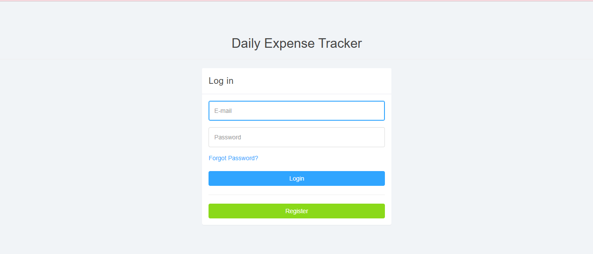            |
| Register Page     | 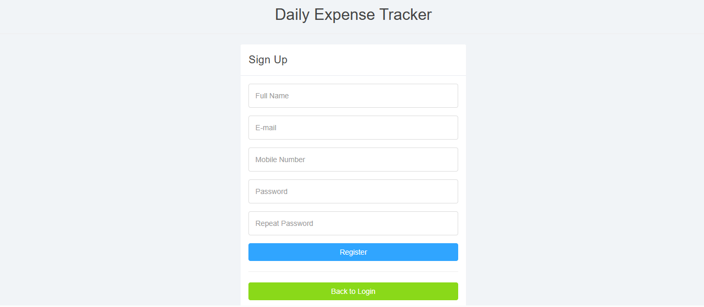         |
| forgot Password   | 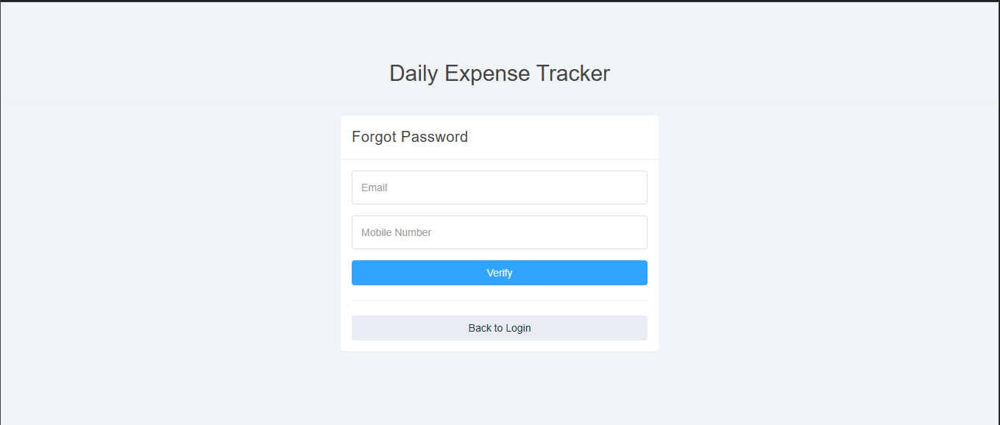  |
| Reset Password    | 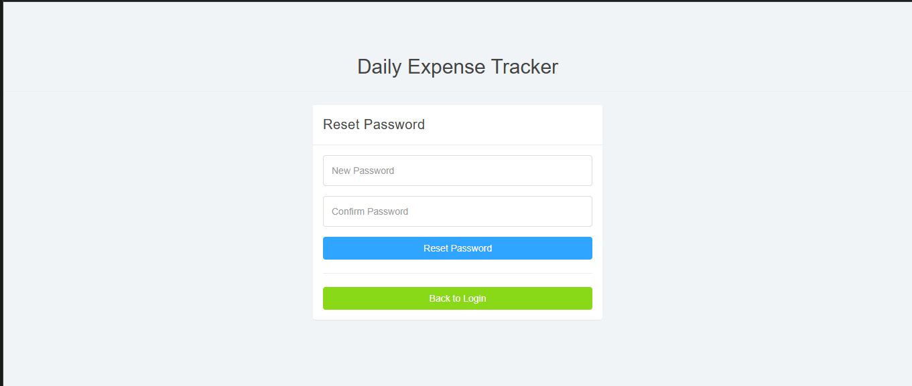   |
| Dashboard         | 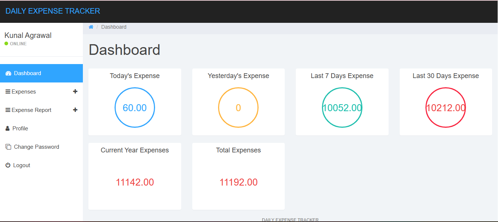        |
| Add Expense       | 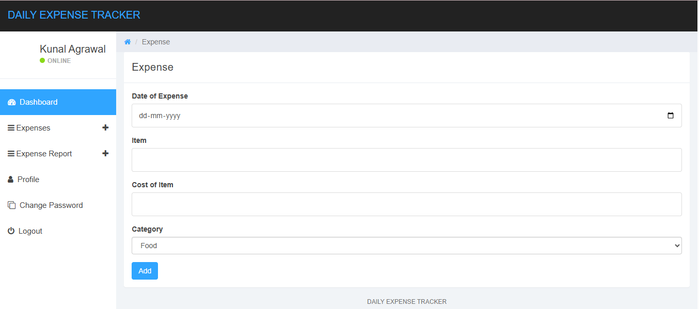      |
| Manage Expenses   | 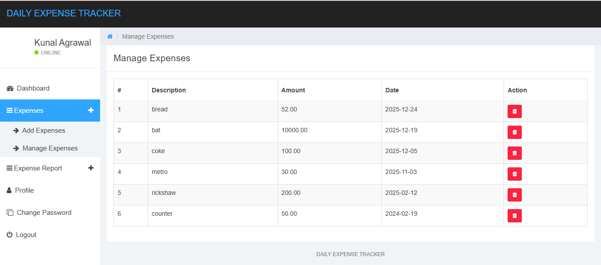   |
| Date-wise Report  | 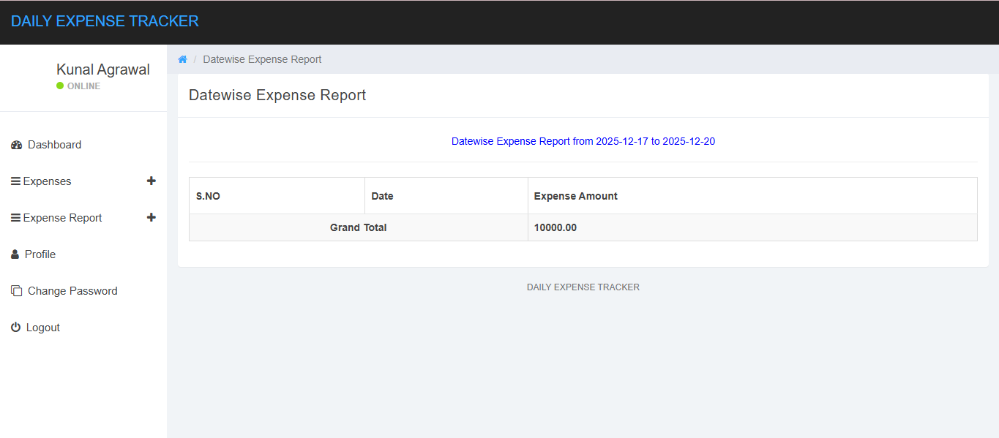  |
| Month-wise Report | 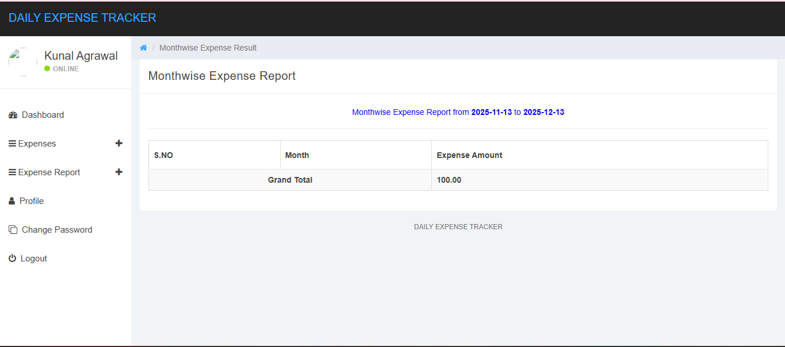 |
| Year-wise Report  | 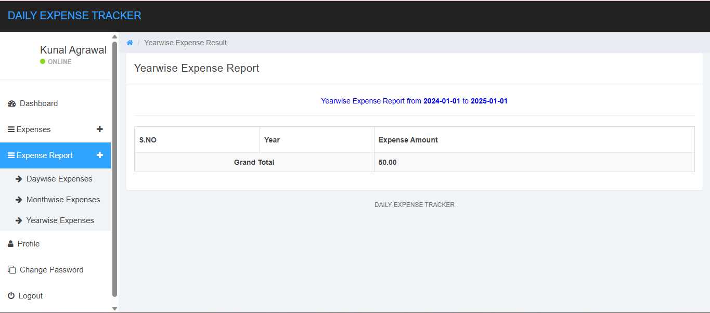  |
| User Profile      | 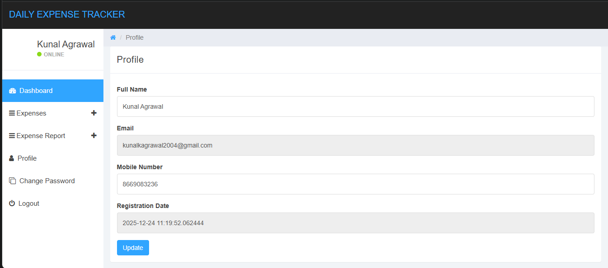     |
| Change Password   | 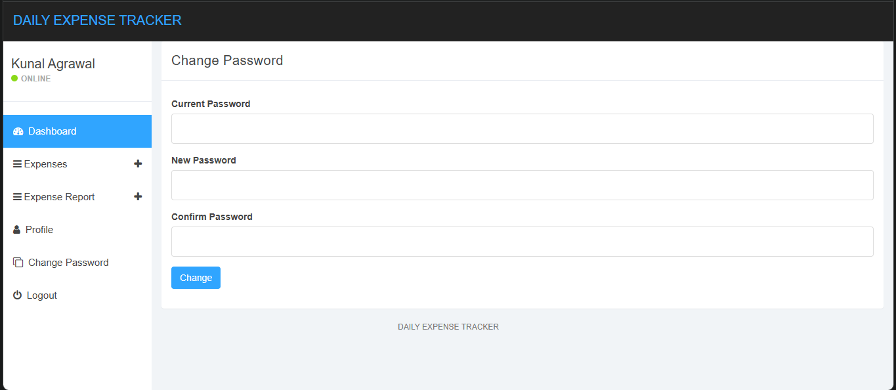  |

---
## Configuration ⚙️

Update database credentials in `DBConnection.java`:

```java
private static final String URL  = "jdbc:postgresql://localhost:5432/mvcdetsdb";
private static final String USER = "postgres";
private static final String PASS = "password";
```

---

## How to Run ▶️

1. Clone the repository

```bash
git clone https://github.com/kunal-agr/mvcdets.git
```

2. Create database

```sql
CREATE DATABASE mvcdetsdb;
```

3. Import project as Maven project
4. Configure Apache Tomcat 11
5. Run the project

```
http://localhost:8080/MVC_DETS/login.jsp
```

---

## Purpose 🎯

This project was built to gain hands-on experience with:

* MVC Architecture
* Authentication & Session Management
* JDBC with PostgreSQL
* Dashboard Analytics
* Clean and scalable project structure

---

## License 📄

This project is licensed under the MIT License.

---

## Contribution 🤝

Fork the repository and feel free to improve or extend the project.
